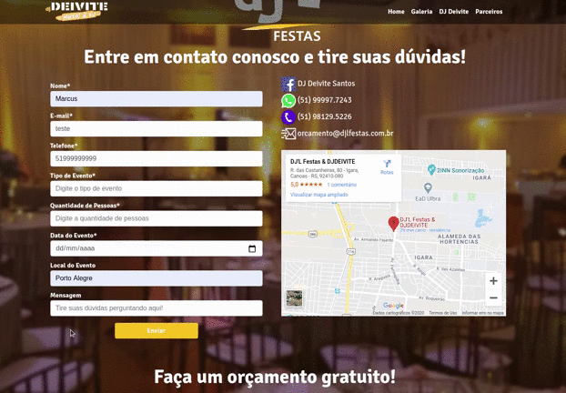
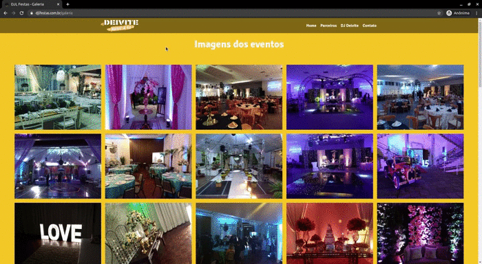

# DJL Festas
My first real project, a simple website with a focus on the visual for advertising a company.  
Languages and libraries were used:
* HTML & CSS
* JavaScript
* PHP  
* Pace.js (For visually good loading)
* Lightbox (For make the gallery)
* Bootstrap (For make development easier and faster)
* Normalize (For standardization in all browsers)  
# Site Images  
### Index
 
 
### The validate is with javascript and it is async

### Gallery

### And it's responsive

